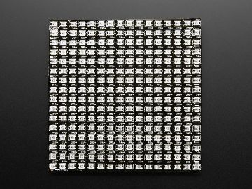
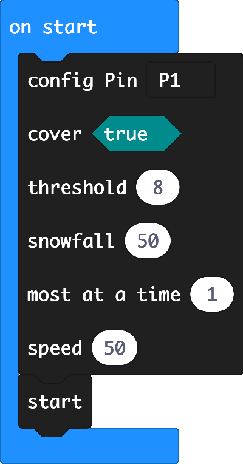
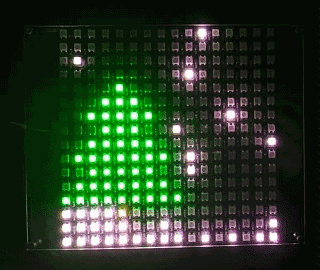

# snowflake

makecode snow flake extension for 16x16 neopixel matrix display

Author: shaoziyang  
Date:   2018.Dec  



## Add extension

open your microbit makecode project, in Add extension, paste  

https://github.com/makecode-extensions/snowflake  

to search box then search.


## Basic usage
```
snowflake.config(
DigitalPin.P1,
true,
8,
50,
1,
50
)
snowflake.start()
```

## API


- **function load_background(dat: number[])**  
Load a user back ground picture.  
You may using microbittoolbox to convert data and paste to javascript code.  
https://github.com/shaoziyang/microbit-lib/tree/master/utils/microbit_toolbox  

- **function load_default_backgroud()**  
Load default back ground: christmas tree

- **function config(pin: DigitalPin, cover: boolean, threshold: number, snowfall: number, MostAtATime: number, speed: number)**  
configurate snow, you may adjust paramters to get different effect.
  * pin, which is used to control neopixel matrix
  * cover, enable/disable snow cover effect
  * threshold, snow cover threshold, range is [1-100]
  * snowfall, how much snow is falling, range is [1-100]
  * MostAtATime, new snowflake most at a time
  * speed, snowfall speed, the bigger the slower  
  

- **function start()**  
start/resume snowfall. Function start() need to be called only once, not in a loop.

- **function pause()**  
pause snowfall.

- **function reset()**  
restart.


## Demo





## License

MIT

Copyright (c) 2018, microbit/micropython Chinese community  

## Supported targets

* for PXT/microbit

[From microbit/micropython Chinese community](http://www.micropython.org.cn)
